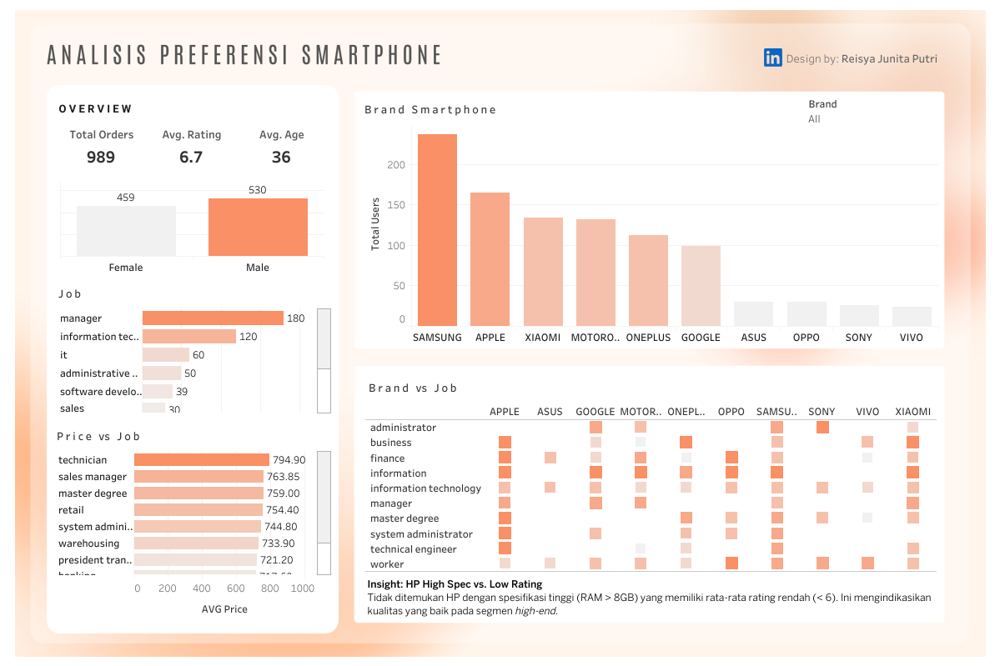

  
  
  

# 📱 **Studi Preferensi Fitur Smartphone Berdasarkan Segmen Profesional**
### 🎯 *Insight Pelanggan untuk Strategi Pemasaran Merek*  
*(Proyek Analisis Rekomendasi Smartphone)*  

---

## 🧩 **Pendahuluan**
Dalam pasar smartphone yang sangat kompetitif, memahami preferensi pengguna menjadi kunci dalam merancang strategi produk dan pemasaran yang efektif.  
Studi ini bertujuan untuk menggali pola preferensi konsumen berdasarkan **latar belakang profesional mereka** — agar merek dapat merancang **strategi segmentasi pasar berbasis data** yang lebih tepat sasaran.  

---

## 🧭 **Gambaran Umum Proyek**
Proyek ini menganalisis **preferensi pelanggan terhadap merek dan fitur smartphone** berdasarkan **latar belakang pekerjaan** mereka.  
Dengan memanfaatkan data rating dan spesifikasi perangkat, analisis ini memberikan wawasan yang dapat membantu merek dalam menargetkan segmen profesional yang paling sesuai.

### 💡 *Tujuan Utama:*
- Mengetahui **merek smartphone yang paling disukai** di tiap segmen pekerjaan.  
- Mengidentifikasi **model smartphone berspesifikasi tinggi namun memiliki rating rendah**.  
- Menganalisis **perbedaan harga rata-rata pembelian** antar segmen pekerjaan.

---

## 📂 **Dataset**
**Sumber Data:** [Cellphones Recommendations Dataset – Kaggle](https://www.kaggle.com/datasets/meirnizri/cellphones-recommendations)  

**Deskripsi Singkat:**
- 🔹 Spesifikasi smartphone: merek, model, sistem operasi, RAM, baterai, harga, dll.  
- 🔹 Profil pengguna: pekerjaan, jenis kelamin, usia.  
- 🔹 Rating pengguna terhadap masing-masing model smartphone.  

---

## 💼 **Pertanyaan Bisnis**
| No | Pertanyaan | Tujuan Analisis |
|----|-------------|----------------|
| 1 | Apakah terdapat perbedaan minat terhadap merek smartphone di berbagai segmen pekerjaan? | Segmentasi preferensi merek berdasarkan profesi |
| 2 | Model smartphone mana yang memiliki spesifikasi tinggi namun rating rendah? | Mengidentifikasi potensi ketidaksesuaian target pasar |
| 3 | Bagaimana perbandingan harga rata-rata pembelian smartphone antar pekerjaan? | Mengidentifikasi segmen dengan daya beli tertinggi |

---

## ⚙️ **Alur Analisis (Analytical Workflow)**
Proyek ini dilakukan sepenuhnya menggunakan **SQL (MySQL)** dan divisualisasikan menggunakan **Tableau**.

| Tahap | File SQL | Tujuan |
|-------|-----------|--------|
| 📦 Import Data | `01_import_data.sql` | Membuat tabel, relasi, dan memuat dataset ke dalam database |
| 🔍 EDA | `02_EDA.sql` | Mengeksplorasi struktur data, missing values, duplikasi, dan outlier |
| 🧹 Cleaning | `03_data_cleaning.sql` | Standarisasi teks, menghapus data anomali, dan mengonversi tipe data |
| 📊 Analysis | `04_analysis.sql` | Menjawab pertanyaan bisnis dengan query analitis |
| 🎨 Visualization | Tableau Dashboard | Menyajikan visualisasi interaktif untuk stakeholder |

---

## 📊 **Temuan Utama (Key Findings)**

### 🔹 1. Dominasi dan Kepuasan terhadap Merek
- **APPLE (47)** dan **SAMSUNG (28)** merupakan dua merek dengan **jumlah rating sempurna (10)** terbanyak.  
- Hal ini menunjukkan bahwa **merek premium memberikan tingkat kepuasan tertinggi** di berbagai segmen pekerjaan.

### 🔹 2. Segmen Teknologi Paling Aktif dan Puas
- Kelompok pekerjaan di bidang **Teknologi (IT, Software Developer, Information Technology)** merupakan segmen yang **paling aktif memberikan rating sempurna**.  
- Mereka adalah audiens potensial untuk promosi smartphone flagship atau high-performance.

### 🔹 3. Daya Beli Berdasarkan Pekerjaan
| Pekerjaan | 💰 Rata-rata Harga Beli (USD) | 💬 Insight |
|------------|-----------------------------|------------|
| Technician | **794.9** | Daya beli tertinggi |
| Sales Manager | **763.8** | Profesi dengan willingness to pay tinggi |
| Master Degree | **759.0** | Segmen profesional mapan |

### 🔹 4. Spesifikasi Tinggi Sesuai Ekspektasi
- Tidak ditemukan model smartphone dengan spesifikasi tinggi (RAM > 8 GB) yang memiliki rating rata-rata rendah (< 6).  
- Artinya, **smartphone dengan spesifikasi tinggi memenuhi ekspektasi pengguna** dan diterima dengan baik di pasar.

---

## 💡 **Rekomendasi Bisnis**
| 🎯 Fokus | 💬 Strategi |
|-----------|-------------|
| Pemasaran Tertarget | Fokuskan promosi flagship (Apple & Samsung) ke segmen pekerjaan di bidang Teknologi. |
| Program Loyalitas Premium | Kembangkan bundling eksklusif untuk segmen Technician & Sales Manager yang memiliki daya beli tinggi. |
| Konsistensi Kinerja Produk | Pastikan kualitas smartphone high-spec tetap konsisten karena memiliki persepsi pasar yang positif. |

---

## 📈 **Dashboard Visualisasi**
📊 Dashboard interaktif menampilkan distribusi rating, perbandingan harga, dan dominasi merek di berbagai segmen pekerjaan.  

> 🔗 **[Lihat Dashboard Interaktif di Tableau Public](https://public.tableau.com/app/profile/reisya.junita/viz/CellphonesDashboard/CellphonesDashboard)**

  
  
<i>Visualisasi preferensi merek smartphone berdasarkan profesi</i>

---

## 🛠️ **Tools dan Teknologi**
| Tools | Fungsi |
|--------|--------|
| 🗄️ **MySQL** | Import data, cleaning, transformasi, dan analisis |
| 📊 **Tableau Public** | Visualisasi interaktif dan dashboard |
| 💻 **VS Code** | Penulisan dan eksekusi skrip SQL |
| 🔗 **GitHub** | Dokumentasi proyek dan version control |

---

## 👩‍💻 **Pengembang**
**Nama:** Reisya Junita Putri  
**Peran:** Data Analyst  
🔗 [LinkedIn](https://www.linkedin.com/in/reisyajunita/)  

---

## 🚀 **Struktur Folder Proyek**
📁 Cellphones_Recommendation_Analysis  
│  
├── 01_import_data.sql  
├── 02_EDA.sql  
├── 03_data_cleaning.sql  
├── 04_analysis.sql  
├── dashboard/  
│  └── cellphones_dashboard.png  
└── README.md  

---

## 🧠 **Kesimpulan**
> 1. Analisis ini menunjukkan bahwa **merek premium dengan performa tinggi sangat dihargai oleh segmen profesional**, khususnya mereka yang bekerja di bidang teknologi.  
> 2. Dengan pemahaman segmen berbasis data, perusahaan dapat **merancang strategi pemasaran yang lebih tertarget** serta meningkatkan **kepuasan dan loyalitas pelanggan.**  
> 3. Proyek ini memperkuat pemahaman bahwa **analisis data yang baik tidak berhenti di angka**, melainkan pada kemampuan menerjemahkannya menjadi strategi yang relevan bagi bisnis.  
